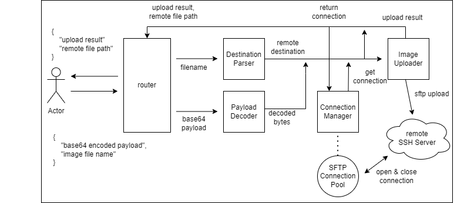

# webflux-sftp-image-gateway

This is a sample image data uploader.

It decodes Base64-encoded image data from request body json and uploads decoded bytes to the target remote SFTP Server.

### Reactive Programming

It uses webflux(reactor streams and netty) for an asnyc flow.

### SFTP Connection Pool

Opening a new SSH Connection is so expensive that we should avoid opening a new SSH connection per request and consider to reuse pre-open connections.

To prevent opening a new SSH connection for each request, it implements a SFTP connection pool managing sftp connections in memory with concurrent hash map collection.

### Flow

### Specification
- maven
- Spring Boot Webflux (2.6.6)
- [jsch 0.2.7(unofficial)](https://github.com/mwiede/jsch)
